### Autores
* Thiago Henrique da Costa   206234 
* Giovanna Gennari Jungklaus 198010 


# Série 2

Considere as tabela C(m1,m2), M(m) e Cloop(m1,m2) na página contem.html: escreva expressões da Álgebra Relacional (AR) para as consultas Q6 a Q12.

Através do utilitário sql2.lab.ic.unicamp.br/metasql.php, com o SGBD mysql, a base de dados test e as tabelas C(m1,m2), M(m) e Cloop(m1,m2), lá contidas, escreva e teste soluções em SQL para as consultas Q6 a Q12 (traduzidas literalmente da AR para SQL), submetendo em pdf o resultado de cada consulta. Nota: elimine duplicatas.

## Exemplos das tabelas

Exemplo da tabela C (na Base de Dados test)
m1  m2
1   2
2   3
3   4
3   5
3   6
7   6
7   2
8   2
9   2

Para resolver os problemas Q11 e Q12 utilize a tabela Cloop.
Exemplo da tabela Cloop
m1  m2
1   2
2   3
3   4
3   5
3   6
6   3
3   1

## Consultas

### A Tabela C 

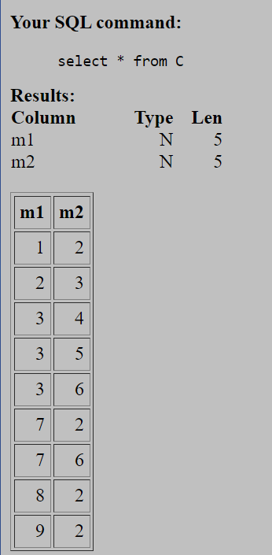

### A Tabela Cloop 

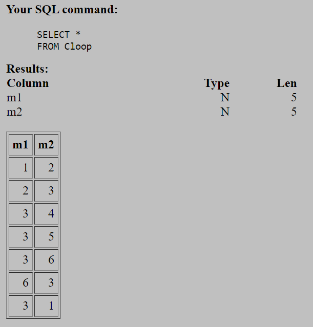

Considere a tabela C(m1,m2) representando o auto-relacionamento N x N
entre materiais (slides Cap4 24-), com o significado:
m1 contém m2 (ou, m2 está contido em m1).
Escreva expressões da Álgebra Relacional para as seguintes consultas (queries):

Q0: dê uma lista de todos os materiais.

```sql
SELECT DISTINCT m1
FROM C
UNION
SELECT DISTINCT m2
FROM C
ORDER BY m1
```
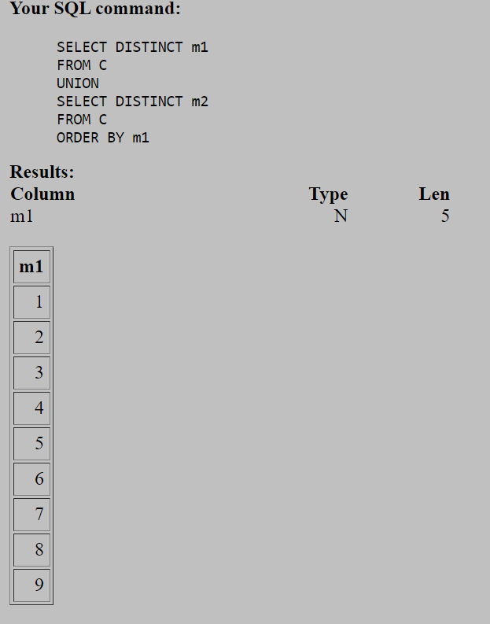

$\tau_{m1 \ asc}(\pi_{m1} c\cup_{}^{}\pi_{m2}c)$

Q1: dê uma lista dos materiais que contêm um ou mais materiais.
```sql
select distinct C.m1 from C 
```
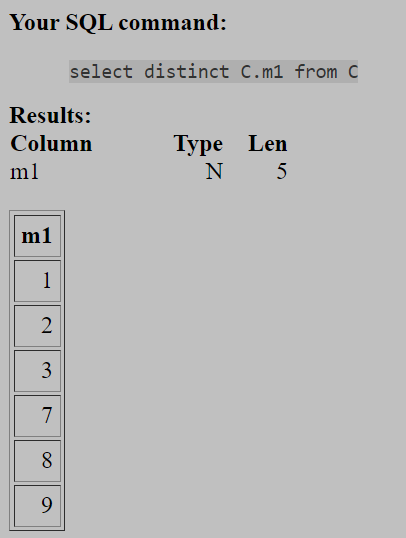

$$\delta$$
$$\pi _C.m1^C$$


Q2: dê uma lista dos materiais que estão contidos em outros materiais.
```sql
select distinct C.m2 from C
```
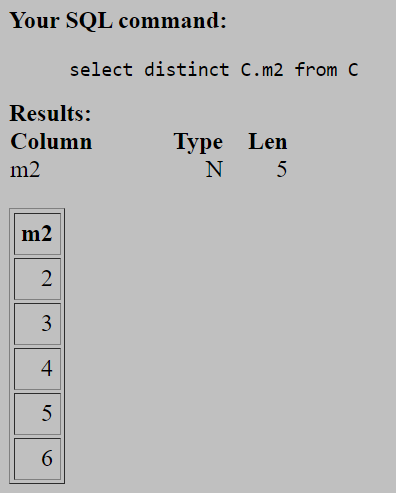

$$\delta$$
$$\pi _C.m2^C$$


Q3: dê uma lista dos materiais que contêm outros materiais e também estão contidos em um ou mais materiais.
```sql
SELECT DISTINCT m1
FROM C
WHERE m1 IN (SELECT DISTINCT m2 FROM C)
```
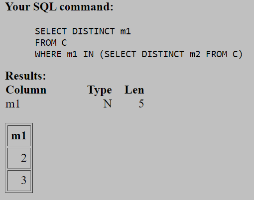

$\pi_{m1}\pi_{m1}C\cap (\pi_{m2}C)$


Q4: dê uma lista dos materiais que não contêm nenhum material.
```sql 
SELECT DISTINCT m2
FROM C
WHERE m2 NOT IN (SELECT m1 FROM C)
```
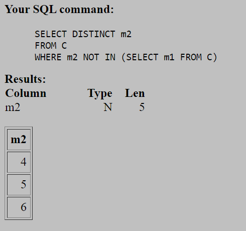

$\pi_{m2}\pi_{m2}C - (\pi_{m1}C)$


Q5:dê uma lista dos materiais que contêm um ou mais materiais mas não estão contidos em nenhum material.
```sql
SELECT DISTINCT m1
FROM C
WHERE m1 NOT IN (SELECT m2 FROM C)
```
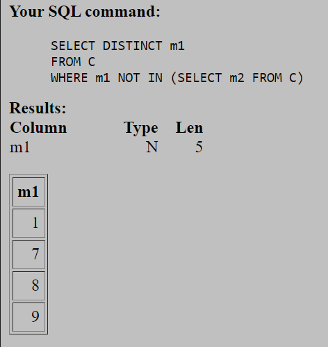

$\pi_{m1}\pi_{m1}C - (\pi_{m2}C)$


Considere agora a tabela M(m, nome, tipo) e defina  os atributos m1 e m2 da tabela C como Chaves Estrangeiras referenciando a Chave Primária m de M.


Q6: dê uma lista dos materiais "obsoletos", isto é, que não contêm nem estão contidos em nenhum material
```sql
SELECT m
FROM M
WHERE m NOT IN 
(SELECT DISTINCT m1
FROM C
UNION
SELECT DISTINCT m2
FROM C
```
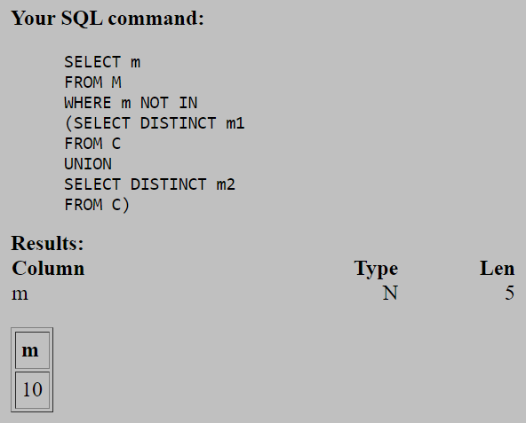

$\pi_{m}\pi_{m}M - (\pi_{m1}C\cup\pi_{m2}C)$


Q7: dê uma lista dos materiais que contêm dois ou mais materiais.
```sql 
SELECT C.m1 FROM C GROUP BY C.m1 HAVING COUNT(C.m1) > 1
```
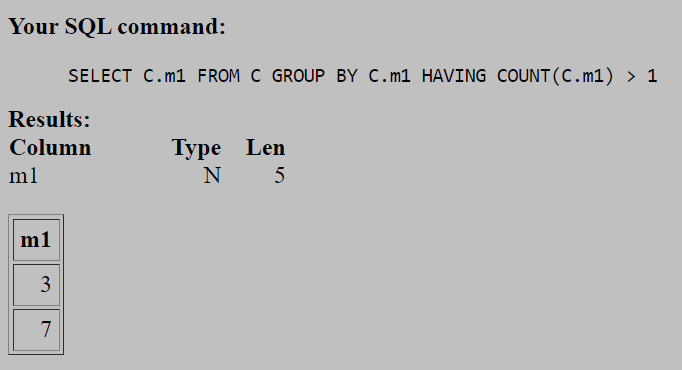

$$\pi _C.m1$$
$$\sigma_{COUNT(m1) > 1}$$
$$\gamma_{m1, COUNT(m1)^C}$$

Q8: dê uma lista dos materiais que contêm exatamente um material.
```sql
SELECT C.m1 FROM C GROUP BY C.m1 HAVING COUNT(C.m1) = 1
```
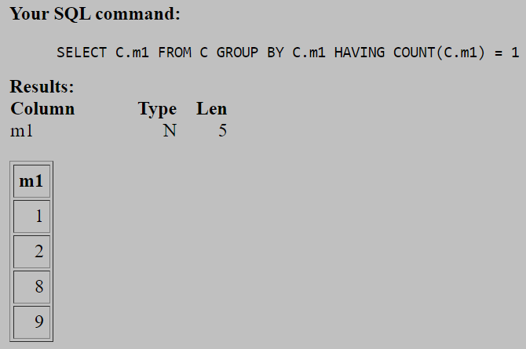

$$\pi _C.m1$$
$$\sigma_{COUNT(m1) = 1}$$
$$\gamma_{m1, COUNT(m1)^C}$$

Q9: Dê uma lista dos materiais que estão contidos em mais de dois materiais.
```sql 
SELECT C.m2 FROM C GROUP BY C.m2 HAVING COUNT(C.m1) > 2
```
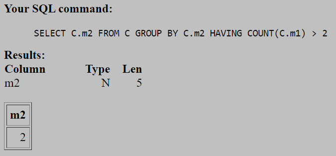

$$\pi _C.m2$$
$$\sigma_{COUNT(m1) > 2}$$
$$\gamma_{m2, COUNT(m1)^C}$$

Q10: Dê uma lista dos materiais que estão contidos em exatamente 1 material.
```sql
SELECT C.m2 FROM C GROUP BY C.m2 HAVING COUNT(C.m1) = 1
```
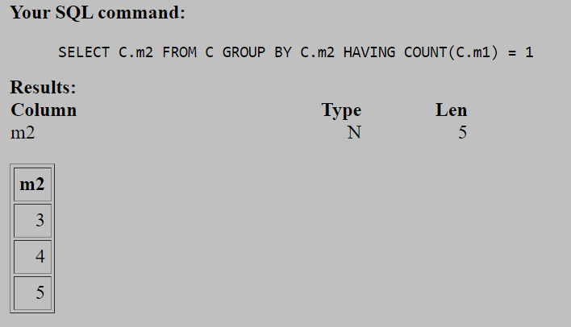

$$\pi _C.m2$$
$$\sigma_{COUNT(m1) = 1}$$
$$\gamma_{m2, COUNT(m1)^C}$$

Q11: verifique se a tabela C tem o seguinte tipo de inconsistencia: algum material a contém um material b que por sua vez contem o material a.
```sql
SELECT * FROM Cloop AS C1, Cloop AS C2 WHERE C1.m1 = C2.m2 AND C1.m2 = C2.m1
```
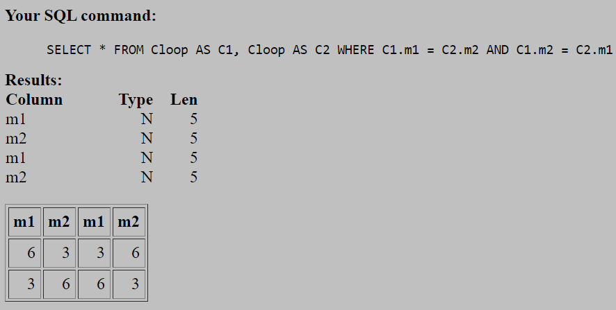

$$\sigma_{c1.m1 = c2.m2 AND c1.m2 = c2.m1}$$
$$(\rho_{c1}cloop \  X  \ \rho_{c2}cloop)$$


Q12: e uma inconsistência do tipo: "a contem b, b contem c e c contem a", como seria detectada?
```sql
SELECT * FROM Cloop AS C1, Cloop AS C2, Cloop AS C3
    WHERE C1.m1 = C3.m2 AND C1.m2 = C2.m1 AND C2.m2 = C3.m1
```
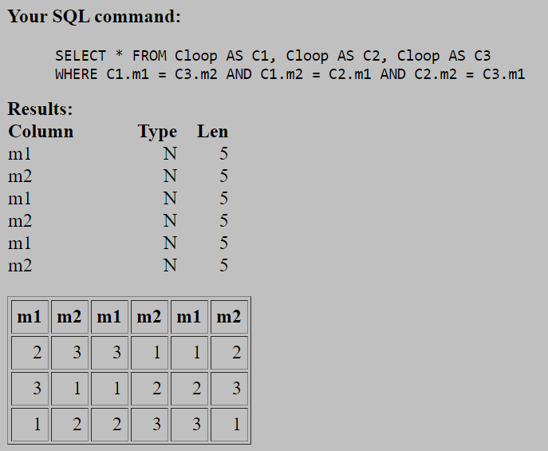

$$\sigma_{c1.m1 = c3.m2 AND c1.m2 = c2.m1 AND c2.m2 = c3.m1}$$
$$(\rho_{c1}cloop \  X  \ \rho_{c2}cloop \  X  \ \rho_{c3}cloop)$$
